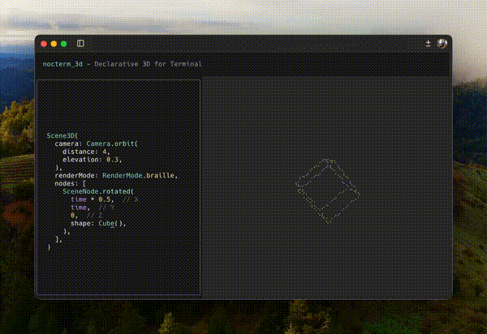

# nocterm_3d

A declarative 3D renderer for terminal using [Nocterm](https://github.com/norbertkozsir/nocterm).

> **Experimental**: This project is in early development and APIs may change.



## Features

- 3D primitives (cubes, pyramids, custom shapes)
- Scene graph with camera system
- Multiple render modes (wireframe, solid, braille)
- Particle systems
- Animation support
- Shading and depth-based rendering

## Usage

```dart
import 'package:nocterm/nocterm.dart';
import 'package:nocterm_3d/nocterm_3d.dart';

void main() async {
  await runApp(const RotatingCubeDemo());
}

class RotatingCubeDemo extends StatelessComponent {
  const RotatingCubeDemo({super.key});

  @override
  Component build(BuildContext context) {
    return AnimatedScene3D(
      duration: const Duration(seconds: 4),
      camera: Camera.orbit(distance: 4, elevation: 0.3),
      builder: (t) {
        final angle = t * 2 * 3.14159;
        return [
          SceneNode.rotated(angle * 0.5, angle, 0, shape: Cube()),
        ];
      },
    );
  }
}
```

## Requirements

- Dart SDK >=3.5.0
- [Nocterm](https://github.com/norbertkozsir/nocterm) ^0.3.2
